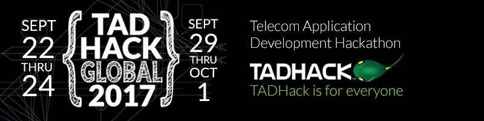

# helpr - [TADHack 2017 Global Winner](http://blog.tadhack.com/2017/10/02/tadhack-global-2017-winners/)

<iframe src="//www.slideshare.net/slideshow/embed_code/key/wNqz9UXG6gMPFv" width="595" height="485" frameborder="0" marginwidth="0" marginheight="0" scrolling="no" style="border:1px solid #CCC; border-width:1px; margin-bottom:5px; max-width: 100%;" allowfullscreen> </iframe> 
 <strong> <a href="//www.slideshare.net/jaquayle/tadhack-global-2017-winners-draft#107" title="TADHack Global 2017 Winners" target="_blank">TADHack Global 2017 Winners</a> </strong>

Meant to supplement a Red Cross type organization in the aftermath of a natural disaster using SMS. Helpr uses SMS and ML to help prioritize disaster assistance and optimize response efforts

## objective

Build a high impact, low latency application to send and receive SMS messages in the event of a natural disaster where resources are strained or non-existent.

SMS is a low throughput technology that casts the widest possible net reaching the most advanced smart phones to old flip phones.

## Tools

Helpr uses:

[Apifonica](https://www.apifonica.com/)  

Enable apps to send, receive, process, and track SMS messages around the world

[Node.JS server](https://nodejs.org/en/) (v.8.5.0)  

Node.js® is a JavaScript runtime built on Chrome's V8 JavaScript engine. Node.js uses an event-driven, non-blocking I/O model that makes it lightweight and efficient. Node.js' package ecosystem, npm, is the largest ecosystem of open source libraries in the world.

[API.ai](https://api.ai)

Natural Language Machine Learning Engine to understand what users are saying
